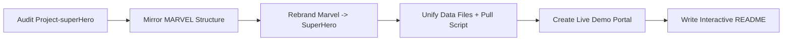

# Project-superHero

<p align="center">
  <a href="https://anis151993.github.io/SuperHero_API/"></a>
  <a href="https://anis151993.github.io/SuperHero_API/live-demo.html"></a>
  <a href="https://github.com/ANIS151993/SuperHero_API.git"></a>
</p>

## Live Pages

- Main demo: https://anis151993.github.io/SuperHero_API/
- Live demo portal: https://anis151993.github.io/SuperHero_API/live-demo.html

## What This Project Is

`Project-superHero` is now developed with the same architecture and UX style as the MARVEL project:

- Animated, searchable character explorer UI
- Local JSON-powered rendering for fast loading
- Unified data sync script (`pull:superhero`)
- GitHub Pages-ready `docs/` deployment
- Matching sub-app variants (`superhero-api`, `superhero-json`, `superhero-generator`)

## How I Completed Project-superHero



### Completion Timeline (March 5, 2026)

1. Compared the current `Project-superHero` folders with `/home/engra/MARVEL`.
2. Copied the MARVEL architecture into this project and mapped naming to `superhero-*`.
3. Rewired app/server/data paths:
   - `superhero_characters.json` in `public/`, `docs/`, `superhero-json/`, `mongodb/`
   - `scripts/pull-superhero-characters.mjs`
   - server routes/models renamed to `SuperheroCharacter`
4. Created a public live demo page for users:
   - [`docs/live-demo.html`](docs/live-demo.html)
   - [`docs/live-demo.css`](docs/live-demo.css)
   - [`docs/live-demo.js`](docs/live-demo.js)
5. Synced data and generated a pull report:
   - [`state/superhero-pull-report.json`](state/superhero-pull-report.json)

## Project Structure

```text
Project-superHero/
├── docs/                  # GitHub Pages site (main demo + live-demo portal)
├── public/                # Root app dataset
├── css/ js/ index.html    # Root SuperHero explorer app
├── scripts/               # Data pull automation
├── characters-server/     # Express + Mongo API server
├── mongodb/               # Mongo seed tooling + dataset
├── superhero-api/         # Variant app (Vite)
├── superhero-json/        # Variant app with local JSON copy
├── superhero-generator/   # Additional variant app
└── state/                 # Pull report snapshots
```

## Run Locally

```bash
# Root app
npm install
npm run dev

# Refresh dataset
npm run pull:superhero
```

```bash
# Optional variants
cd superhero-json && npm install && npm run dev
cd superhero-api && npm install && npm run dev
cd superhero-generator && npm install && npm run dev
```

## Deployment (GitHub Pages)

1. Push this project to `main` in `https://github.com/ANIS151993/SuperHero_API.git`.
2. In GitHub repo settings, enable **Pages** from the `main` branch and `/docs` folder.
3. Public URLs:
   - `https://anis151993.github.io/SuperHero_API/`
   - `https://anis151993.github.io/SuperHero_API/live-demo.html`

## Notes

- Current local sync report is based on the locally available dataset snapshot (270 records) because outbound network access was blocked in this environment during pull execution.
- The pull script is ready to fetch the full Akabab dataset when network is available.
